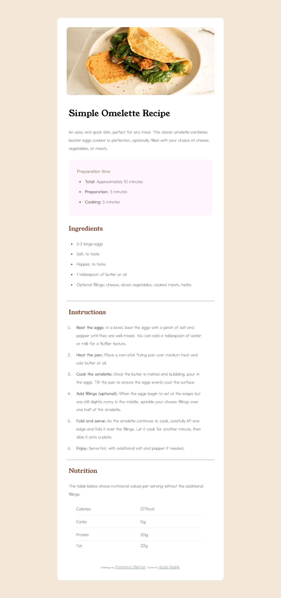

# Frontend Mentor - Recipe page solution

This is a solution to the [Recipe page challenge on Frontend Mentor](https://www.frontendmentor.io/challenges/recipe-page-KiTsR8QQKm). Frontend Mentor challenges help you improve your coding skills by building realistic projects.

## Table of contents

- [Overview](#overview)
  - [The challenge](#the-challenge)
  - [Screenshot](#screenshot)
  - [Links](#links)
- [My process](#my-process)
  - [Built with](#built-with)
  - [What I learned](#what-i-learned)
  - [Continued development](#continued-development)
  - [Useful resources](#useful-resources)
- [Author](#author)

## Overview

### Screenshot



### Links

- Solution URL: (https://h-keshk.github.io/Recipe-Page/)

## My process

### Built with

- Semantic HTML5 markup
- CSS custom properties
- Lists
- Table
- Media queries
- Desktop-first workflow

### What I learned

The styling in this project was smooth and light; For HTML there's no problem with any of the codes, on the other hand, we can say I met some little obstacles in CSS, but there is always a way or trick. For example styling the first UnorderedList to be in it's final look from margin and padding, it took me some time, also the media queries, which I need to focus more on it,  also learned a new styling tip on how to style the (hr) line and give it a color..


```css
ul:first-child {
    margin: 35px 0;
    padding: 35px 50px;
    background-color: hsl(330, 100%, 98%);
    border-radius: 15px;
    -webkit-border-radius: 15px;
    -moz-border-radius: 15px;
    -ms-border-radius: 15px;
    -o-border-radius: 15px;
}
ul:first-child li {
    margin: 10px 10px 10px 18px;
    padding-left: 10px;
}
ul:first-child li span {
    font-weight: 600;
}

hr {
    border-top: 1px solid hsl(30, 54%, 90%);
}
```

### Continued development

I think Ineed to focus more in two important points;
1. The media queries and how to make my design more smooth, yet I don't feel comfrtable with responsive idea.
2. Iwant to learn more how to organize and shortend my codes, not to repeat the codes in different ways, like giving margin and padding to an element, while we can use only one, and it will work perfectly.


### Useful resources

- [Bootstrap Website](https://getbootstrap.com/) - That website helping me a lot through my road; In this project, I used it to give me the perfect screen sizes (Breakpoints) so I can make a neat responsive layout with right dimentions.
- [ChatGPT](https://chatgpt.com/) - Some times there's a specific code I spend so many time to debug it, and I just need a second brain to give a tip, and for that I use ChatGPT from time to time and adapt his ideas to my code line.


## Author

- Frontend Mentor - [@H-Keshk](https://www.frontendmentor.io/profile/H-Keshk)
- X - [@HudaKeshk15889](https://www.twitter.com/HudaKeshk15889)
- Facebook - [@HudaKeshk](https://www.facebook.com/HudaKeshk)
- Github - [@H-Keshk](https://github.com/H-Keshk)
- LinkedIn - [@hoda-mohamed](https://www.linkedin.com/in/hoda-mohamed-180735107/)
